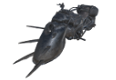

<!--Read this in github to have all the visuals and formatting: https://github.com/manux32/7d2d_A17_sdx_mods/tree/master/manux_CustomVehicles_A17_modlet-->

# A17 Custom Vehicles modlet
|  |  |  |  |  |  
|:---:|:---:|:---:|:---:|:---:|  
| Dust2Death's Road Hog | Hell Goat Bike | Quad | Cicada Car | HP 4x4 Truck |  
  

This is currently an XML-only A17 modlet that features some of my [**A16 Custom Vehicles**](https://github.com/manux32/7dtdSdxMods/tree/master/Manux_CustomVehicles).  
It does not contain all the features I have in my A16 mod. I will not port my full Custom Vehicles mod until A17 stable ships.  
But TFP implemented so many of the features that I have in my A16 mod, that you won't be missing that many features. :smiley:

### Vehicle Features from my A16 mod that are now in A17 vanilla
- Block damage
- Entity damage
- Can drive in water
- Custom Storage Size per vehicle
- Control Player and Camera position via XML
- Custom icon per vehicle
- Flying vehicles
- ...

# Installation
You can simply place this modlet in the Mods folder of your A17 installation.  
I don't think A17 currently supports automatically reading from Localization files that are inside mod folders. So, you can simply copy the content of the _Config/Localization.txt_ file to the Game's _Localization.txt_ file.  

[**SDX Version here**](https://github.com/manux32/7d2d_A17_sdx_mods).

## Vids
|  |  
|:---:|   
|A17 - New toys in action|   

# Terms of use  

## License
**Creative Commons**  
**Attribution-NonCommercial 4.0**  
**International (CC BY-NC 4.0)**  

## In summary:
- This license lets you remix, tweak, and build upon my work __**non-commercially**__, as long as you credit me in your mod.
- You cannot ask for money for downloading your mod, if it includes my mod, or a modified version of my mod. Having a link for voluntary donations for you mod is ok.

Please refer to the 2 links below for more information on the license:  
[**View License Deed**](https://creativecommons.org/licenses/by-nc/4.0/)  
[**View Legal Code**](https://creativecommons.org/licenses/by-nc/4.0/legalcode)  

## Additional Restrictions
Some Assets in this mod were purchased from the [**Sketchfab**](https://sketchfab.com/) store.  
See list below, in the [**Assets and their licenses**](#assets-and-their-licenses) section for more information on the licensing for each 3D Asset.  

### The following additional restrictions apply for the assets that were purchased:  
- If you include those 3D Assets in your mod along with my mod or a modified version of my mod, you do not need to re-purchase them from Sketchfab.
- You cannot distribute those 3D Assets individually, or as part of your mod, if you are not including my mod or a modified version of my mod.
- Those Assets can only be present in your mod if they are in a binary file, like a .unity3d resource file. 
- You cannot extract those Assets from the binary files using Assets extraction softwares, to modify them further, and then add them back to your mod. 
- You cannot ask for money for downloading your mod, if it includes my mod, a modified version of my mod, and/or those Assets from my mod. Having a link for voluntary donations for you mod is ok.
- If you wish to include those purchased assets individually, or make modifications to them, you have to purchase them from Sketchfab.

## Assets and their licenses  
### Purchased Assets  
#### The Beast (Loader)
- **Original 3D Asset:** [**Wheel Loader**](https://skfb.ly/6toGS)
- **Creator:** [**Renafox**](https://sketchfab.com/kryik1023)  
A very talented artist that created the original 3D Asset I used for making The Beast.  
Check-out all the other [great models](https://sketchfab.com/kryik1023) she has for sale.  
- **Asset acquisition: Sketchfab Purchase (25$ CAD)** (Canadian dollars)  
- **Licensing type:** [**Sketchfab Standard**](https://sketchfab.com/licenses)   

#### Quad
- **Original 3D Asset:** [**ATV model practice**](https://skfb.ly/6x9oT)  
- **Creator:** [**Mark Bai**](https://sketchfab.com/bcfbox)  
A talented artist who did the very nice and cheap Sketchfab asset that I used for the Quad vehicle.  
- **Asset acquisition: Sketchfab Purchase (4$ CAD)** (Canadian dollars)  
- **Licensing type:** [**Sketchfab Standard**](https://sketchfab.com/licenses)  

### Free Assets  
#### HellGoat Bike
- **Original 3D Asset:** [**Hell Motogoat**](https://skfb.ly/TCEV)  
- **Creator:** [**chervinin**](https://sketchfab.com/chervinin)  
A great artist who did this amazing asset that I am using for the Hell Goat Bike vehicle. 
- **Asset acquisition: Free Sketchfab Download**  
- **Licensing type:** [**Creative Commons Attribution CC BY 4.0**](https://creativecommons.org/licenses/by/4.0/)  
I made the changes listed below to the Asset in order to be able to integrate it in this mod for the 7 days to die game.  
This mod is public and free, the derived asset is not used in any commercial way.  
- Polygon reduction on all meshes.
- Textures reduction from 2048x2048 to 512x512
- Combine the textures maps to be compatible with the Unity Shaders (Glossiness maps as the alpha channel of Specular maps, Opacity maps as the alpha channel of Diffuse maps)
- Skinning of the meshes on a simple bone structure to be able to animate it in the game.
- Addition of lightbulbs in the eyes of the Goat skull, for when the lights of the vehicle are turned on. Looks awesome!  

#### Helicopter
##### Original Helicopter 3D Model and Movement Controller code
- **Original Assets:** [**Base Helicopter Controller**](https://assetstore.unity.com/packages/tools/physics/base-helicopter-controller-40107)  
I used most of the Helicopter 3D Model to make the Helicopter vehicle, and also used the Controllers code base to make the Helicopter move.  
- **Creator:** [**Sun Cube Studio**](https://www.facebook.com/suncubestudio/)  
A talented person/group who did the wonderful and free Unity Asset Store Base Helicopter Controller system.  
- **Asset acquisition: Unity3D Asset Store Free Download**  
- **Licensing type:** [**Asset Store Terms of Service and EULA**](https://unity3d.com/legal/as_terms)  

##### Helicopter cockpit interior  
- **Original 3D Asset:** [**Military Helicopter**](https://assetstore.unity.com/packages/3d/vehicles/air/military-helicopter-3922)  
I only used the interior cockpit of the 3D Asset to put it in the other Helicopter 3D model above, because that one didn't have any interior cockpit.
- **Creator:** [**Duane's Mind**](https://assetstore.unity.com/publishers/678)  
- **Asset acquisition: Unity3D Asset Store Free Download**  
- **Licensing type:** [**Asset Store Terms of Service and EULA**](https://unity3d.com/legal/as_terms)  

#### Cicada Car
- **Original 3D Asset:** [**Retro Cartoon Cars - Cicada**](https://assetstore.unity.com/packages/3d/vehicles/land/retro-cartoon-cars-cicada-96158)  
This asset has been used to make my fist custom car vehicle. A bit too cartoony for the style of the game, but I kept it because I like it a lot, it's like the minibike of cars. And the player looks so funny when driving it.  
- **Creator:** [**Retro Valorem**](https://assetstore.unity.com/publishers/22495)  
A great artist who did this cute, and free Unity Asset Store 3D Asset.  
- **Asset acquisition: Unity3D Asset Store Free Download**  
- **Licensing type:** [**Asset Store Terms of Service and EULA**](https://unity3d.com/legal/as_terms)  

#### Small Boat
- **Original 3D Asset:** [**boat**](https://skfb.ly/6quTp)  
- **Creator:** [**gromorg**](https://sketchfab.com/gromorg)  
A good artist who did the great little boat model I'm using for the Small Boat vehicle. 
- **Asset acquisition: Free Sketchfab Download**  
- **Licensing type:** [**Creative Commons Attribution CC BY 4.0**](https://creativecommons.org/licenses/by/4.0/)  
I made the changes listed below to the Asset in order to be able to integrate it in this mod for the 7 days to die game.  
This mod is public and free, the derived asset is not used in any commercial way.  
- Added a textured mesh for the boat motor in the back.  
- Added a textured mesh for the small battery in the back.  
- Added a textured mesh for the light in front of the Vehicle to be able to turn the vehicle light on/off.  
- Combine the texture maps to be compatible with the Unity Shaders (Roughness map as the alpha channel of Metallic map)  
- Skinning of the meshes on a simple bone structure to be able to animate it in the game.  

#### Vehicle Gun
- **Original 3D Asset:** [**.308 Machine Gun**](https://skfb.ly/JpM8)  
- **Creator:** [**Johnathon Goswick**](https://sketchfab.com/goswick3)  
A talented artist who has many nice models on Sketchfab. He did the great little .308 Machine Gun I'm using as the Gun Weapon for most vehicles.  
- **Asset acquisition: Free Sketchfab Download**  
- **Licensing type:** [**Creative Commons Attribution CC BY 4.0**](https://creativecommons.org/licenses/by/4.0/)  
I made the changes listed below to the Asset in order to be able to integrate it in this mod for the 7 days to die game.  
This mod is public and free, the derived asset is not used in any commercial way.  
- Removed the wooden parts of the mesh to make it fit better as a vehicle weapon. 
- Added a textured mesh to have an anchor to attach to vehicles.  
- Merged the meshes.  
- Combine the texture maps to be compatible with the Unity Shaders (Roughness map as the alpha channel of Metallic map)  
- Skinning of the meshes on a simple bone structure to be able to animate it in the game.  

#### Vehicle Grenade Launcher
- **Original 3D Asset:** [**Grenade Launcher Free low-poly 3D model**](https://www.cgtrader.com/free-3d-models/military/gun/grenade-launcher--6)  
- **Creator:** [**arslan-9912**](https://www.cgtrader.com/arslan-9912)  
A very talented artist who has many nice models on CG Trader. He did the great little Grenade Launcher I'm using as the Grenade Launcher Weapon for most vehicles.  
- **Asset acquisition: Free CG Trader Download**  
- **Licensing type:** [**CG Trader Royalty Free License**](https://www.cgtrader.com/pages/terms-and-conditions#general-terms-of-licensing)  
I made the changes listed below to the Asset in order to be able to integrate it in this mod for the 7 days to die game.  
This mod is public and free, the derived asset is not used in any commercial way.  
- Removed the gun stock and handle to make it fit better as a vehicle weapon.  
- Added a textured mesh to have an anchor to attach to vehicles.  
- Merged the meshes.  
- Skinning of the meshes on a simple bone structure to be able to animate it in the game.  
- The texture on my version does not look the same as in the link above. Maybe I downloaded an older version or another version from another site, can't remember.  

## Special Thanks

### To the 3D Assets creators 
To all the creators of the 3D Assets I used to make the vehicles. See the list in the **Terms of Use** section above.

### Dust2Death 
For doing all the ground work to find how to make a custom bike in A16, using the game unused Road Hog asset.
He's the one that originally initiated the forum thread we currently use for the A16 mod. When I saw what he did with the RoadHog, it picked my interest. We shared a lot of knowledge and I then started to build this Vehicles mod: [**Custom Vehicles by Manux**](https://7daystodie.com/forums/showthread.php?87828-Custom-Vehicles-by-Manux-SDX)  

### TormentedEmu
For making the Horse vehicle of the Medieval Mod, which has been a great code reference for me when building this mod.  
And also for helping demistify some of the more obscur parts of coding something like this.  
Thanks for her [**MinibikeImpact**](https://github.com/TormentedEmu/7DTD-SDX-Mods/tree/master/MinibikeImpact) mod that I initially used for running over zombies. The mod now has it's own system for running over zombies and creatures, and the way it behaves can be controlled via XML properties.  
Thanks also for her great [**MinibikeOpenUI mod**](https://github.com/TormentedEmu/7DTD-SDX-Mods/tree/master/MinibikeOpenUI), that let's us open UIs like the Map, the backpack, or any other Character UIs, while driving.  

### [HAL9000](https://www.youtube.com/channel/UCemM152wfyOsGCBaSkDaDCQ)
**HAL9000** has been giving me great technical advice recently, helping me especially with understanding how to deal with the Multi Player code.  He is an amazing modder and the father of the SDX Launcher we use to build SDX mods for the game. He's a great mentor, thank you so much Master **HAL9000**!

### Mumpfy
A very talented visual artist that is also a 7d2d modder. He retextured some of the coolest Vehicles of this mod to make them fit better in the mood of the game. They look awesome!
He retextured the following vehicles so far: 
- Dust2Death's RoadHog
- The Beast
- Helicopter

### Three8
For adding underwater capabillities to all vehicles in the A16 mod. He is a top notch modder doing stuff like a fully working Elevator.

### JaxTeller718  
For doing great sounds for Dust2Death's A16 Road Hog. I am also using those sounds on the Hell Goat Bike and the Loader.
